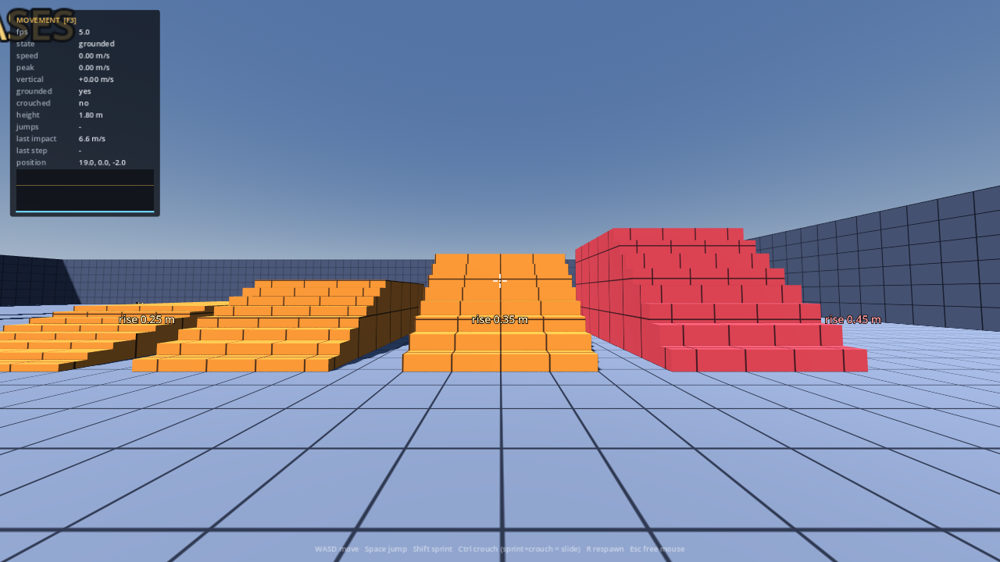

# BestFPS

A first person shooter built from scratch in Godot 4, prioritising movement feel,
gunplay and bots — in that order.

**[▶ Play it in your browser](https://b-2222.github.io/BestFPS/)**

[](https://github.com/B-2222/BestFPS/actions/workflows/web.yml)

**Current state: Milestone 3 — bots.** Movement, four weapons, a shooting range
with targets at measured distances, and enemies that hunt you, take cover behind
line of sight, and shoot back. See [ROADMAP.md](ROADMAP.md).



*The test blockout. Every obstacle is labelled with its dimension — here the
0.25 m and 0.35 m staircases are climbable and the 0.45 m one is deliberately
not.*

---

## Running it

### In a browser

<https://b-2222.github.io/BestFPS/> — click the page to capture the mouse, then
play. Needs WebGL 2, which every current desktop browser has. First load pulls
about 11 MB (a 44 MB WebAssembly runtime, served compressed) and takes a few
seconds.

Every push rebuilds and redeploys it automatically, and the build only ships if
the movement smoke test passes.

Expect it to feel slightly worse than the desktop build: browsers run the
Compatibility (WebGL) renderer rather than Forward+, and mouse input goes
through pointer lock. **Judge the movement feel on desktop**, not here.

> Already live — the first deploy succeeded, so nothing needs configuring. If
> the link ever 404s, check **Settings → Pages → Build and deployment** is still
> set to source **"GitHub Actions"**; that is the one setting a workflow cannot
> set for itself.

### Playing with someone else

Multiplayer is **LAN only and desktop only**. The browser build cannot do it:
browsers have no raw UDP sockets, and the WebSocket alternative needs an HTTPS
page to open an insecure connection to a LAN address, which browsers refuse and
a LAN address cannot get a certificate for. Reasoning in
[docs/networking-decision.md](docs/networking-decision.md).

So both players download a desktop build. Every push builds all three: open the
latest run under
[Actions](https://github.com/B-2222/BestFPS/actions), scroll to **Artifacts**,
and take `BestFPS-macOS`, `BestFPS-Windows` or `BestFPS-Linux`.

**On macOS**, the build is unsigned, so Gatekeeper will refuse it on the first
open. Unzip it, then once:

```sh
xattr -dr com.apple.quarantine /path/to/BestFPS.app
```

Then open it normally. (Right-click → Open works too, but has to be repeated.)
It is a universal binary, so it runs natively on both Apple Silicon and Intel.

Then, in game, press **F5** for the multiplayer panel. One player clicks
**Host** and reads out the ten-character code; the other types it in and clicks
**Join**. You both need to be on the same network — the code is your LAN
address, not an account.

The host simulates everything, so bots and the duel wing run on the host's
machine and everyone sees the same fight.

### On desktop

1. Install **Godot 4.4** or newer (standard build, not .NET) — <https://godotengine.org/download>
2. Open the project: `Import` → select `project.godot`
3. Press **F5**

First launch takes a moment while Godot imports and builds its class cache.

### If Godot crashes

Godot 4 defaults to the **Forward+** renderer, which hard-requires a working
Vulkan driver and dies rather than falling back when there isn't one. That is
the most common reason it crashes on laptops, integrated GPUs and managed
school machines.

**This project is already set to the Compatibility (OpenGL) renderer** for
exactly that reason, so pull the latest code before trying again — the fix is
in `project.godot` and only applies once you have it.

If it still crashes:

1. **Launch Godot itself in OpenGL mode.** The Project Manager runs before it
   reads any project setting, so a Vulkan crash there needs a command-line
   flag. Windows: `Godot_v4.4.1-stable_win64.exe --rendering-driver opengl3`
   (or add ` --rendering-driver opengl3` to the end of a shortcut's *Target*).
   macOS/Linux: same flag from a terminal.
2. **Update your graphics drivers**, then try Forward+ again.
3. **Check where it dies** — on the Project Manager, on import, on opening the
   3D scene, or on pressing F5. That distinction says which of the above is
   the culprit.

You do not need the editor to make progress. Every change is built and
verified in CI, and the browser build above is always current.

## Controls

| Input | Action |
|---|---|
| `W` `A` `S` `D` | Move |
| Mouse | Look |
| `Space` | Jump |
| `Shift` | Sprint |
| `Ctrl` / `C` | Crouch (hold) |
| `Shift` + `Ctrl` while moving | Slide |
| Left mouse | Fire |
| Right mouse | Aim down sights |
| `R` | Reload |
| `1`–`4` / wheel | Switch weapon |
| `Backspace` | Respawn at spawn point |

Bots are on by default. Press `Esc` to change how many there are (0–12) and how
good they are — **Recruit**, **Regular** or **Veteran**. Both take effect
immediately, without restarting the level.

Every binding in that table can be changed in the settings menu (`Esc`), and
your choices persist between sessions. Master volume and mouse sensitivity are
there too — both worth turning down on a laptop.

### Sound

All of it is **synthesised at load**, not loaded from files: gunshots are
filtered noise plus a pitch-swept body, footfalls and impacts are damped low
noise, and interface blips are swept sines. Each weapon gets its own character
from four numbers. There are no audio files in this repo and no licence
attached to any of it — see `scripts/audio/sound_bank.gd`. Real recordings
replace the streams later without touching anything that plays them.
| `F3` | Toggle the tuning HUD |
| `F1` | Slide on/off (try both — see below) |
| `F2` | Auto bunny-hop on/off (try both — see below) |
| `Esc` | Settings — rebind any key, adjust volume and mouse sensitivity |

## The test level

A measured blockout, not a map. Every obstacle is labelled in-world with its
dimension so feedback can be specific. Sections bracket the controller's limits
on purpose — 0.35 m and 0.40 m ledges either side of the step limit, 45° and 55°
ramps either side of the walkable angle, gaps from 2 m to 6 m.

**If you only do one thing:** press F3 and work through the ten tests in
[docs/movement-tuning.md](docs/movement-tuning.md).

### The weapons

Four roles, balanced against each other rather than in isolation. Every number
lives in `assets/config/weapons/*.tres` and can be edited without touching code.

| | Damage | Head | Rate | Mag | Body shots to kill | Notes |
|---|---|---|---|---|---|---|
| **Rifle** `1` | 22 | 2.2x | 600 rpm, auto | 30 | 5 (0.40 s) | The baseline everything else is tuned against |
| **Shotgun** `2` | 13 x 9 pellets | 1.5x | 75 rpm | 6 | 1 up close | Useless past ~18 m; falls to 28% damage |
| **Sniper** `3` | 88 | 2.6x | 45 rpm | 5 | 2 — **1 headshot** | Sights through a real scope: the weapon is hidden and the screen becomes the optic. Pinpoint aimed, wild from the hip; slowest to carry |
| **Pistol** `4` | 18 | 2.4x | 420 rpm | 15 | 6 | Fastest to draw (0.25 s) and the only one that does not slow you down |

They differ in more than damage: movement speed, aim-down-sights zoom, reload
and equip times, spread while moving, and recoil are all per-weapon. Recoil is
deliberately mild on all four — sustained climb stays under 2.1 deg/s, which a
trackpad can still counter, and a test enforces that ceiling.

### The shooting range

Along the north wall. Targets at 10, 20, 30 and 45 m, fanned sideways so the
near one does not block the far ones, plus a strafing target at 55 m. Each
dummy shows its own health, has an orange head worth 2.2x damage, and revives
three seconds after it goes down.

Shots leave bullet holes on walls and floors that fade after about nine
seconds, tracers are drawn from the barrel rather than the camera, and the
crosshair gap is the **real spread cone** converted to pixels, so it shows
exactly where a bullet can land — it grows while you move and while you hold
the trigger, and shrinks when you aim.

## The bots

Bots are a `PlayerController` with a `BotBrain` where you have a `PlayerInput`.
Both answer the same call — `fill_command(cmd, delta)` — and that is the entire
integration. A bot has no private movement path, no direct line into the weapon
code, and no way to make a shot happen other than setting `fire_held` and
waiting for the gun to be ready. So it accelerates, jumps, slides, reloads and
misses on exactly the code you do.

**Everything a bot knows, it could have learned like you.** It has a view cone,
a line of sight traced against world geometry, ears that scale with how loud
something was, and a memory of where you *were* that expires. Difficulty is made
out of reaction time, turn speed, aim wobble and trigger discipline — never out
of extra information. That is a deliberate choice: bots that see through walls
are much less work and produce opponents you can only avoid, not beat.

### The duel wing — judging one tier at a time

Walk east out of the arena, through the doorway marked **DUEL WING**. Three
sealed rooms off a corridor, one per difficulty, each signed with the tier's
name and its actual numbers:

| Room | Reaction | Aim error | Sight |
|---|---|---|---|
| **Recruit** | 0.62 s | 5.4° | 34 m |
| **Regular** | 0.34 s | 2.6° | 55 m |
| **Veteran** | 0.19 s | 1.1° | 75 m |

Each room holds exactly one bot of that tier, permanently, and **nothing else
can get in**. Bots are confined to their own room in code as well as by the
walls, free-roaming bots are held to the main arena, and a bot dropped
somewhere it does not belong walks back. A baffle wall inside each door means
the occupant cannot shoot down the corridor at you on your way to a different
room, and cannot be fought from outside without stepping in.

The rooms are identical apart from their occupant — same size, same cover, same
spawn distance — so the only variable between them is the profile. That is the
whole point: it is the difference between "bots feel too hard" and "Veteran
kills me before I finish the peek". The HUD names the room you are standing in.

Turn them off with **Duel-wing bots** in the settings menu; they are a separate
roster from the **Bots** count, which only fills the main arena.

Which means the counterplay is real:

| What you do | Why it works |
|---|---|
| Break line of sight | It hunts where you *were*, and walks there to look |
| Flank the cone | It sees 110°–160° depending on tier, not 360° |
| Crouch to move | Footsteps carry about a third as far |
| Strafe across it | Aim error grows with your lateral speed |
| Peek and re-peek | Reaction time is spent again on every re-acquire |
| Push a hurt one | Below its threshold it gives ground, then commits |

Bots have jointed bodies with a real walk cycle — hips swing, knees fold, and
the stride is driven by distance travelled so the legs land with the footstep
sounds at any speed. Torso and head sit exactly on their hitboxes and never
move, so what you see there is what you hit; only the legs, which animate, and
the arms, which are cosmetic, differ.

Three tiers in `assets/config/bots/*.tres` — Recruit, Regular, Veteran — and a
new one is a file, not a code change. The roster carries a mix of rifles,
shotguns and pistols, and a bot holds its weapon where you can see it, because
"that one has a shotgun, do not let it close" should be a decision you can make
before it closes.

Health regenerates after six seconds out of contact. Without it one bad trade
decides every fight for the rest of the session, and the game becomes about
avoiding fights.

Details and the reasoning: [docs/architecture.md](docs/architecture.md) §10.

## Weapon models

Every weapon currently draws a procedural box silhouette. Real models drop in
without touching code: put a `.glb` in `assets/models/weapons/`, set
`view_model_scene` (first person) and/or `world_model_scene` (what bots hold)
in the weapon's `.tres`, and point `model_muzzle` at the barrel tip.

Damage, fire rate, spread, recoil and the shot trace all read from the `.tres`
and from that marker, never from the mesh — so art can never quietly change
where bullets go. Full instructions and sourcing notes, including which
licences work outside Unreal, are in
[assets/models/weapons/README.md](assets/models/weapons/README.md).

## Tuning it yourself

Open `assets/config/player_default.tres` in the inspector and edit values **while
the game is running**. Every number that decides how the player feels is in that
one resource. Full guide: [docs/movement-tuning.md](docs/movement-tuning.md).

## Tests and CI

```
godot --headless --path . --script scripts/tests/movement_smoke_test.gd
```

```
godot --headless --path . --script scripts/tests/combat_smoke_test.gd
```

```
godot --headless --path . --script scripts/tests/bot_smoke_test.gd
```

154 behavioural checks across the three suites, all exiting non-zero on failure.

- **Movement (22):** top speed, deceleration, jump apex against `v²/2g`, stair
  climb and descent, the step-height limit, crouch, slide, bunny-hop bounds.
- **Combat (50):** fire rate, damage, falloff, headshot reward, time-to-kill,
  reload, recoil recovery, and that spread is reproducible from the command tick.
- **Bots (82):** mostly *fairness* claims rather than behaviour ones — that a
  bot cannot see through a wall or behind itself, does not shoot at a wall
  someone vanished behind, spends its reaction time before firing, hears gunfire
  but not from across the map, forgets a target it has lost, and fires no faster
  than its weapon allows — plus that the duel wing stays isolated: one bot per
  room, none of them leaves, and fighting one does not pull the others in.

That last suite exists because those bugs are invisible by feel: losing to a bot
that cheats feels exactly like losing to a good one, so it has to be caught by
assertion rather than by playing.

Feel is not testable and has to be judged by hand. These cover the things that
*are* objective and that break silently when a tuning value is edited.

`.github/workflows/web.yml` runs all three on every push and gates the web
deploy on them, so a broken build never reaches the play link.

## Layout

```
scenes/   player, bot and level scenes
scripts/  core/ player/ weapons/ combat/ bots/ audio/ levels/ ui/ tests/
assets/   config/ player, weapons/*.tres, bots/*.tres
docs/     engine choice, architecture, tuning guide
.github/  web build + Pages deploy workflow
```

## Documentation

- **[ROADMAP.md](ROADMAP.md)** — milestones and exit criteria
- **[docs/engine-choice.md](docs/engine-choice.md)** — why Godot + GDScript, what
  we give up by not using Unity, and the risk register
- **[docs/architecture.md](docs/architecture.md)** — the decisions that would be
  expensive to reverse
- **[docs/movement-tuning.md](docs/movement-tuning.md)** — what every dial does
  and how to test it
- **[docs/networking-decision.md](docs/networking-decision.md)** — the
  multiplayer model, and what it forces on the weapon code today
